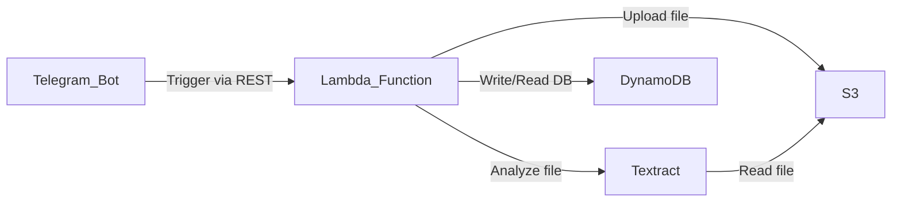

# Expense Chat Bot App
<p align="center">

</p>

### **Before Begin**
> I recommend to check pricing for Lambda, S3, Textract, and DynamoDB, because there is possibility you will getting charge for what you used
### **Diagram**

### **Requirements**
1. [Serverless Framework](https://www.serverless.com/framework/docs/getting-started) installed
2. [AWS CLI](https://docs.aws.amazon.com/cli/latest/userguide/cli-configure-quickstart.html) configured
3. [Telegram Bot](https://core.telegram.org/bots/tutorial) configured
### **Create S3 Bucket**
1. Before we begin, please create S3 Bucket
### **Deploy With Serverless Framework**
1. Clone repository
```
git clone https://github.com/ludesdeveloper/expense_app.git
```
2. Please update your organization inf serverless.yml file
```
org: PLEASE_CHANGE_THIS_WITH_YOUR_ORGANIZATION
app: expense-app
service: expense-app
```
3. Install wsgi plugin 
```
serverless plugin install -n serverless-wsgi
```
4. Install python requirements plugins
```
serverless plugin install -n serverless-python-requirements
```
5. Init & deploy serverless framework, and follow instruction
```
sls
```
### **Configure Telegram Bot Webhook**
1. Run script below, enter your lambda url and telegram bot token 
```
./set_webhook.sh
```
### **Update Lambda Environment Variable**
1. Open your AWS Lambda Console, and go to Function -> Your Function -> Configuration -> Environment Variable
2. Create new Environment Variable with key TELEGRAMAPI, and for value is your bot api token
3. Create new Environment Variable with key BUCKET_NAME, and for value is your bucket name
4. Create new Environment Variable with key TELEGRAMUSERID, and for value is your userid
### **Interraction With Bot**
1. You can say hi to and bot will return "Hello!!"
```
hi
```
2. You can upload your receipt to be parse by bot 
3. You can get information about total within date range
```
range 2022-12-11 2022-12-12
```
> This example to get range in 11 December 2022
### **Preview**
You can take a look preview [here](https://www.linkedin.com/posts/seski-ramadhan_chatbot-app-telegram-activity-7007646714887122945-Fq1B?utm_source=share&utm_medium=member_desktop)
### **Destroy Application**
1. Remove all AWS stack
```
sls remove
```